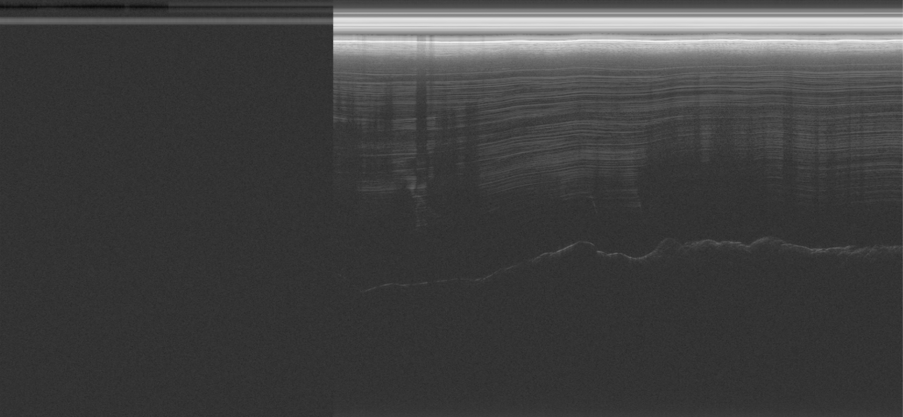
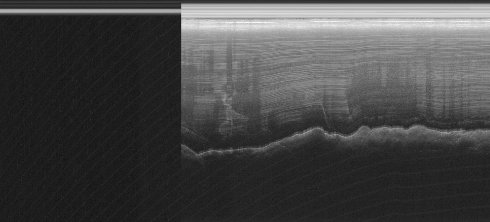
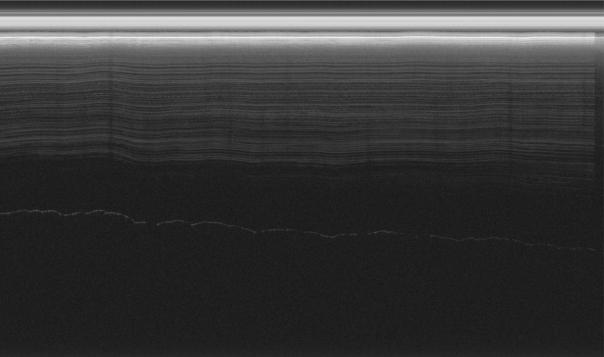
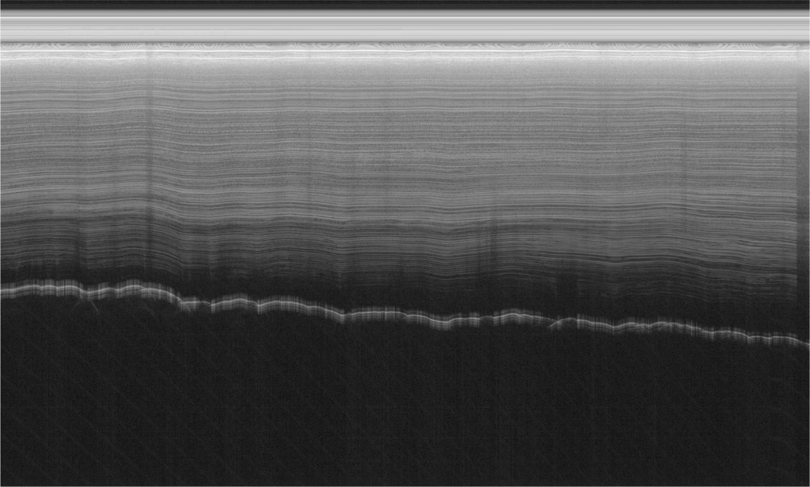
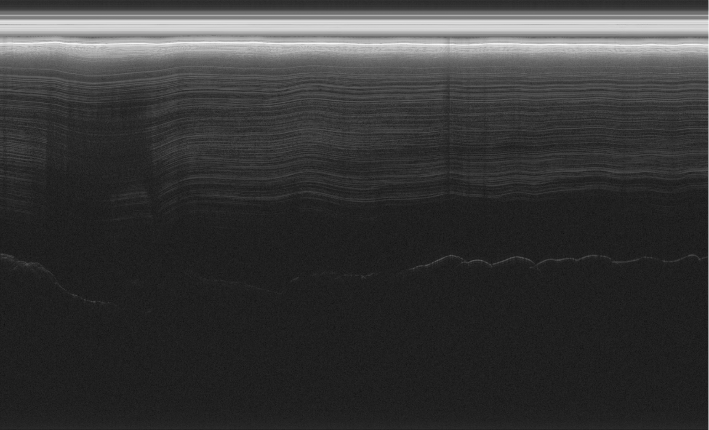
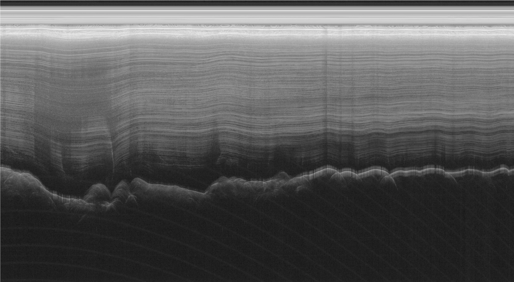

# Geospatial Image Processing and Visualization

## 🎯 Objective

* To process and visualize geophysical data stored in a .nc file using Python. The file follows the NetCDF4 data model and format, and the goal is to extract and render the data as a geographical image through certain python libraries.

---

First, you need to download the latest python version on the official website of Python. Use the pip command to get the modules you want via command line.

---

## 📂 Python Modules

pip install numpy

pip install matplotlib

pip install xarray

pip install netCDF4 

---

## 🐍 Python

Python will be utilized to display radargrams with visualization. Modifying the file path of the .nc file, importing relevant libraries, and extracting data values is what the process entails.

## 📂 File

* GeoData-IP-Visual.ipynb
---

## 📊 Results
### Radargrams Generated through Image Processing
Radargram 1

Radargram 2

Radargram 3

Radargram 4

Radargram 5

Radargram 6

